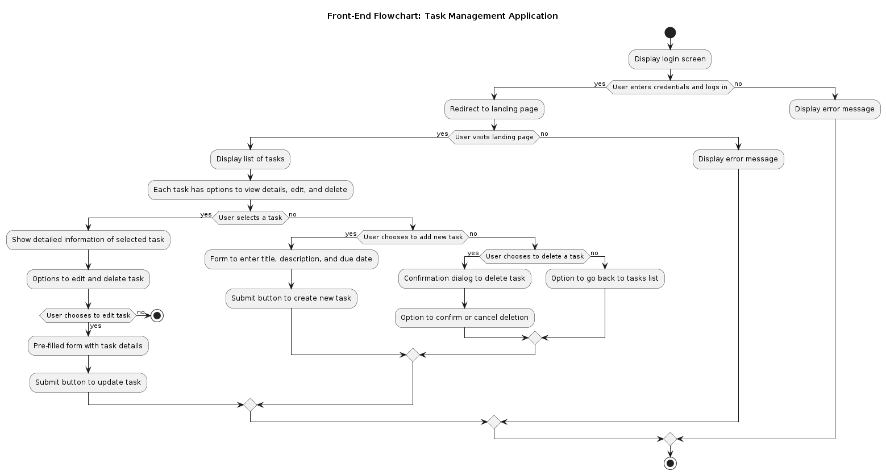
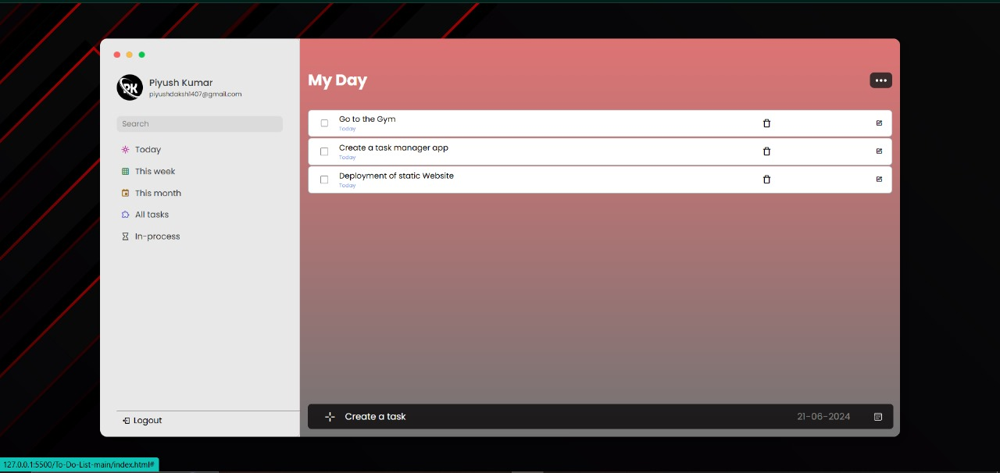
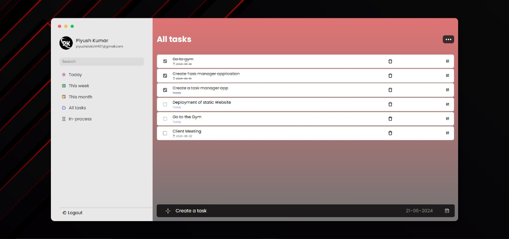
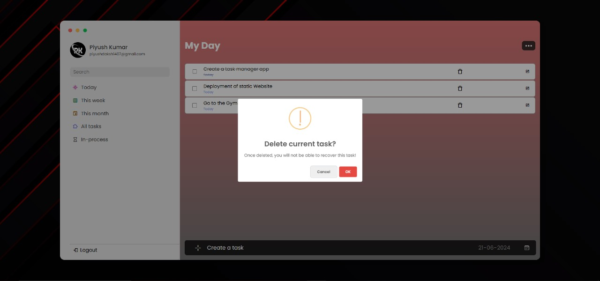
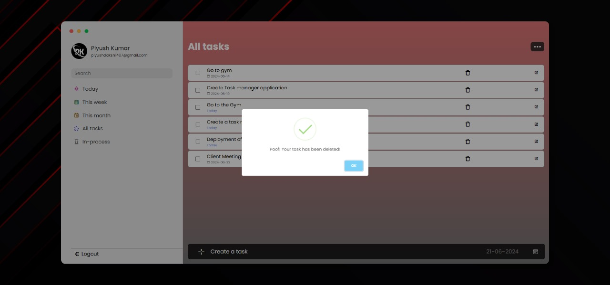

# Task Management Application

## Overview

The Tasksynenergy is basically a Task Management Application is designed to help users organize their tasks efficiently. It provides functionalities for managing tasks such as creating new tasks, viewing task details, editing tasks, and deleting tasks. The application is built with a focus on user-friendly interface and responsiveness for both desktop and mobile devices.

## Features

- **User Authentication**:
  - Secure login functionality with error handling for invalid credentials.

- **Task Management**:
  - Display a list of tasks with options to view, edit, and delete tasks.
  - Detailed task view with title, description, and due date.
  - Form to add new tasks with validation for title and due date.
  - Edit existing tasks with pre-filled forms and update capabilities.
  - Confirmation dialog for deleting tasks to prevent accidental deletions.

- **Responsive Design**:
  - Ensures usability and visual appeal on various screen sizes.
 
  ### Flowchart



Addition to visualize the flow of the Task Management Application.


## Technologies Used

- **Front-End**:
  - HTML5, CSS3, JavaScript (ES6+)
  - React.js for building user interfaces
  - Bootstrap or Material-UI for UI components and styling

- **Back-End**:
  - Node.js and Express.js for RESTful API development
  - MongoDB or MySQL for data storage (optional: include if applicable)

## Installation

To run this project locally, follow these steps:

1. Clone the repository:
   ```
   git clone https://github.com/your-username/task-management-app.git
   ```
   
2. Navigate to the project directory:
   ```
   cd task-management-app
   ```

3. Install dependencies:
   ```
   npm install
   ```

4. Start the development server:
   ```
   npm start
   ```

5. Open your browser and visit:
   ```
   http://localhost:3000
   ```

## API Documentation

- **Endpoints**:
  - `GET /api/tasks`: Retrieves all tasks.
  - `POST /api/tasks`: Creates a new task.
  - `GET /api/tasks/:taskId`: Retrieves a single task by its ID.
  - `PUT /api/tasks/:taskId`: Updates an existing task.
  - `DELETE /api/tasks/:taskId`: Deletes a task by its ID.

## Usage

- **User Interface**:
  - Navigate through the application using the intuitive user interface.
  - Create, view, edit, and delete tasks as needed.

### Authentication Flow


### Project Insights








- **API Integration**:
  - Integrate the provided API endpoints with the front-end to manage tasks programmatically.

## Contributing

Contributions are welcome! Here's how you can contribute to this project:
- Fork the repository
- Create a new branch (`git checkout -b feature-branch`)
- Make your changes
- Commit your changes (`git commit -am 'Add new feature'`)
- Push to the branch (`git push origin feature-branch`)
- Create a new Pull Request

## License

This project is licensed under the MIT License - see the [LICENSE](LICENSE) file for details.
